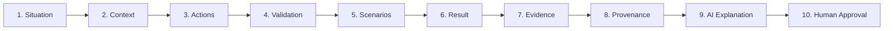

# EDOS Architecture Specification
**Enterprise Decision Operating System**

---

## 1. System Vision & Core Philosophy

### 1.1 What is EDOS?
**EDOS (Enterprise Decision Operating System)** is an explainable, reproducible, and auditable operational decision platform. In high-stakes business environments—such as supply chain management, logistics, and resource allocation—enterprises frequently suffer from fragmented heuristics, opaque spreadsheet models, and unreliable "black box" automated tools. 

EDOS bridges this gap by structuring operational events into a deterministic decision pipeline, computing verifiable outcomes, maintaining forensic audit trails, and leveraging generative AI strictly to articulate natural-language justifications for human operators to review and authorize.

### 1.2 Core Principle
> **"The system calculates. AI explains. Humans approve."**

* **The system calculates**: Numerical projections, candidate evaluations, optimization trade-offs, and constraint enforcement are executed strictly via deterministic code and mathematical formulas. AI is never used as an unconstrained calculator or a source of truth for numerical decisions.
* **AI explains**: Large Language Models (LLMs) synthesize structured outputs, citations, and risk matrices into lucid, concise operational narratives tailored for human understanding.
* **Humans approve**: EDOS provides governed human-in-the-loop (HITL) workflows. Critical decisions are submitted to authorized decision-makers who can accept, reject, modify, or escalate recommendations with recorded rationale.

### 1.3 V1 Philosophy
* **One End-to-End Decision Workflow**: EDOS V1 intentionally eschews generic dashboard sprawl or free-form chatbots in favor of one deeply engineered, high-confidence decision workflow (focused initially on inventory stockouts and supply-chain intervention).
* **Modular Monolith**: Zero distributed systems complexity, message queues, or premature microservices until validated domain boundaries necessitate them.

---

## 2. End-to-End Operational Decision Pipeline

Every decision managed by EDOS proceeds sequentially through a 10-stage pipeline:



| # | Pipeline Stage | Description & Responsibility |
|---|----------------|------------------------------|
| **01** | **Situation** | Ingestion, identification, and normalization of the operational event or triggering anomaly (e.g., supplier delay, projected stockout, demand surge). |
| **02** | **Context** | Aggregation of business state, current inventory positions, lead times, cost matrices, contracts, and operational SLAs relevant to the situation. |
| **03** | **Actions** | Identification and generation of candidate operational interventions (e.g., expedited freight, alternative supplier purchase, order split, buffer drawdown). |
| **04** | **Validation** | Hard-constraint screening against business rules, regulatory policies, budget ceilings, and contract minimums to eliminate invalid actions. |
| **05** | **Scenarios** | Deterministic simulation and impact modeling across surviving actions, evaluating trade-offs (e.g., unit cost vs. delivery speed vs. stockout risk). |
| **06** | **Result** | Selection and scoring of the optimal recommended action alongside ranked alternative options. |
| **07** | **Evidence** | Mathematical proof sheets, intermediate equations, parameter tables, and direct citations backing up every scoring metric. |
| **08** | **Provenance** | Immutable metadata capturing data snapshots, rule engine versions, code hashes, and execution timestamps for forensic reproducibility. |
| **09** | **AI Explanation** | Natural-language executive summary and trade-off justification synthesized from the deterministic calculations and evidence artifacts. |
| **10** | **Human Approval** | Final governed sign-off interface empowering the human operator to approve, reject, annotate, or escalate the recommendation. |

---

## 3. High-Level Architecture Topology

```
┌────────────────────────────────────────────────────────────────────────┐
│                        Next.js 14 Web UI                               │
│  - App Router, TypeScript, React 18, Enterprise CSS System             │
│  - Layout Shell: Collapsible Sidebar, Header, Breadcrumbs, System Status│
│  - Screens: Overview Dashboard, Pipeline Visualizer, Decision Views    │
└────────────────────────────────────┬───────────────────────────────────┘
                                     │ HTTP / REST (Port 3000 -> 8000)
┌────────────────────────────────────▼───────────────────────────────────┐
│                        FastAPI Backend Gateway                         │
│  - Python 3.11+, Typed Pydantic Settings, Uvicorn Server              │
│  - Health Checks, API Routing, Error Handling                          │
└────────────────────────────────────┬───────────────────────────────────┘
                                     │ In-Process Modular Monolith Calls
┌────────────────────────────────────▼───────────────────────────────────┐
│                        Core Decision Runtime                           │
│  ┌───────────────────────┐  ┌───────────────────────┐                  │
│  │    Context Engine     │  │    Decision Engine    │                  │
│  │ (Ingestion & State)   │  │ (Candidate Generation)│                  │
│  └───────────┬───────────┘  └───────────┬───────────┘                  │
│  ┌───────────▼───────────┐  ┌───────────▼───────────┐                  │
│  │   Validation Engine   │  │    Scenario Engine    │                  │
│  │ (Policies/Constraints)│  │ (Impact Projections)  │                  │
│  └───────────┬───────────┘  └───────────┬───────────┘                  │
│  ┌───────────▼──────────────────────────▼───────────┐                  │
│  │             Evidence & Provenance Engine         │                  │
│  │   (Calculations, Formula Auditing & Lineage)     │                  │
│  └───────────────────────┬──────────────────────────┘                  │
│  ┌───────────────────────▼──────────────────────────┐                  │
│  │                AI Explanation Layer              │                  │
│  │  (Constrained Narrative Synthesis from Evidence) │                  │
│  └───────────────────────┬──────────────────────────┘                  │
│  ┌───────────────────────▼──────────────────────────┐                  │
│  │             Governance & Approval State          │                  │
│  │  (Human Sign-off, Audit Trail & State Machine)   │                  │
│  └──────────────────────────────────────────────────┘                  │
└────────────────────────────────────┬───────────────────────────────────┘
                                     │
┌────────────────────────────────────▼───────────────────────────────────┐
│                           Data & Schemas                               │
│  - data/raw: Raw source records and historical datasets                │
│  - data/processed: Normalized operational snapshots                    │
│  - data/schemas: Data fixtures, JSON schemas, and entity contracts     │
└────────────────────────────────────────────────────────────────────────┘
```

---

## 4. Current Implementation Status ("What We Have Done So Far")

The repository is structured according to a phased 30-day plan. Here is a detailed account of what has been implemented to date:

### 4.1 Day 1: System Foundation
* **Repository Architecture**: Monorepo layout structured into `apps/api`, `apps/web`, `data/`, and `docs/`.
* **FastAPI Backend (`apps/api`)**:
  - Initialized with Python 3.11+ packaging using `pyproject.toml` and `setuptools`.
  - Configured typed application settings in `app/config.py` supporting environment variable overrides (`ENVIRONMENT`, `API_HOST`, `API_PORT`).
  - Implemented `/health` endpoint in `app/main.py` responding with service status.
  - Automated unit test suite via `pytest` and `httpx` in `tests/test_health.py`.
* **Web Foundation (`apps/web`)**:
  - Initialized Next.js 14 with TypeScript, App Router (`app/`), and modern configuration.
* **Infrastructure & Automation**:
  - `docker-compose.yml` orchestrating containerized builds for both API and Web frontend with environment wiring.
  - Top-level `Makefile` for developer workflow (`make install`, `make dev-api`, `make dev-web`, `make test`, `make lint`).
  - `.env.example` defining default port configurations and endpoints.
* **Core Documentation**:
  - `README.md` defining project vision, core principle, target architecture, and 30-day roadmap.
  - `docs/architecture/system-overview.md` codifying the 7 architectural principles and V1 pipeline stages.
  - `data/README.md` detailing the file-based data ingestion structure.

### 4.2 Day 2: Enterprise UI Foundation & Application Shell
* **Comprehensive Design System (`apps/web/app/globals.css`)**:
  - Built a bespoke, 1,000+ line enterprise CSS design system with CSS custom properties (variables) for theme tokens.
  - Dark-tinted slate neutral palette, calibrated contrast ratios, glassmorphic header accents, and crisp card borders.
  - Cohesive typography scale, flexible spacing units, and subtle micro-interactions (pulse states, hover elevation).
* **Application Shell & Layout (`apps/web/components/layout/`)**:
  - `app-shell.tsx`: Root responsive shell uniting the sidebar and header around main content.
  - `header.tsx`: Global top-bar with breadcrumb trail, real-time live system status indicator ("READY - SYSTEM OPERATIONAL"), global quick search input (`Ctrl+K`), notifications bell trigger, and user profile avatar.
  - `sidebar.tsx`: Collapsible navigation drawer featuring brand identity, status badge, structured domain navigation, active route highlighting, and quick keyboard shortcut badge (`[`).
* **Reusable UI Primitives (`apps/web/components/ui/`)**:
  - `badge.tsx`: Multi-tone badges (`default`, `neutral`, `success`, `warning`, `danger`, `outline`).
  - `card.tsx`: Surface containers supporting headers, subheaders, and actions.
  - `button.tsx`: Variant-driven buttons (`primary`, `secondary`, `outline`, `ghost`, `danger`) with sizing options.
  - `status-indicator.tsx`: Semantic status indicator with animated ping/pulse rings for operational readiness.
* **Overview Screen (`apps/web/app/page.tsx`)**:
  - Hero header introducing the Foundation Phase and system purpose.
  - Operational KPI cards: **Active Decisions**, **Pending Reviews**, and **System Status** (tied to real-time ready state).
  - Empty state activity viewer showing audit readiness for incoming operational triggers.
  - Visual **Operational Decision Pipeline** step-flow component showcasing the standard 9-stage sequence.
### 4.3 Day 3: Enterprise Design System (Light Theme Migration)
* **Light Enterprise Theme Transition (`apps/web/app/globals.css`)**:
  - Pivoted from dark theme to an information-dense, high-contrast, technical **Light Enterprise Theme** ("enterprise command center" aesthetic).
  - Established semantic tokens: `--background` (`#f8fafc`), `--surface` (`#ffffff`), `--surface-subtle` (`#f1f5f9`), `--surface-elevated`, `--border` (`#e2e8f0`), `--border-strong` (`#cbd5e1`), `--text-primary` (`#0f172a`), `--text-secondary` (`#475569`), `--text-muted` (`#64748b`), `--text-disabled` (`#94a3b8`), `--accent` (`#0284c7`), `--success`, `--warning`, `--danger`, `--info`.
  - Comprehensive typography scale: Display, Page Title, Section Title, Card Title, Body, Body Small, Metadata, Caption, and Monospace.
  - Strict 8-step spacing system: 4, 8, 12, 16, 24, 32, 48, 64px.
* **Component Primitives Suite (`apps/web/components/ui/`)**:
  - `button.tsx`: 5 variants (`primary`, `secondary`, `outline`, `ghost`, `danger`) across 3 sizes (`sm`, `md`, `lg`).
  - `card.tsx`: Consistent borders, subtle elevation support, header titles, descriptions, and action slots.
  - `badge.tsx`: Semantic variants (`default`, `neutral`, `success`, `warning`, `danger`, `info`, `outline`).
  - `status-indicator.tsx`: Semantic states (`READY`, `ACTIVE`, `PROCESSING`, `PENDING`, `WARNING`, `ERROR`, `NEUTRAL`) with restrained pulse.
  - `decision-badge.tsx`: Visual design tokens for all 8 EDOS decision states (`Detected`, `Processing`, `Validated`, `Recommended`, `Pending Review`, `Approved`, `Rejected`, `Escalated`).
  - `input.tsx` & `select.tsx`: Fully accessible form controls with helper text, error states, and icon slots.
  - `tabs.tsx`: Accessible border-bottom tab switcher with badges.
  - `tooltip.tsx`: Lightweight directional tooltips (`top`, `bottom`, `left`, `right`).
  - `metric.tsx`: Reusable KPI card foundation with labels, prominent values, notes, and status badges.
  - `data-table.tsx`: Enterprise table with numeric alignment, hover states, selection states, and compact/comfortable density toggle.
  - `key-value.tsx`: Structured operational attribute layout (multi-column, monospace values).
  - `timeline.tsx`: Vertical operational stage timeline with completed, active in-progress, upcoming, and error step nodes.
  - `empty-state.tsx`, `loading-state.tsx`, `error-state.tsx`: Enterprise operational state containers.
* **Design System Showcase (`apps/web/app/design-system/page.tsx`)**:
  - Dedicated living catalog at `/design-system` demonstrating all 15 component families, typography, colors, and interactive behaviors.
* **Overview Migration (`apps/web/app/page.tsx`)**:
  - Refactored overview screen to use the new light theme, `Metric`, `EmptyState`, `Card`, and `Badge` primitives.

### 4.4 Day 4: ShopFlow Domain Model
* **Operational Domain Models (`apps/api/app/domain/`)**:
  - Established strongly-typed Pydantic v2 domain models representing the operational supply chain entities:
    - `Product` (`product.py`): id, SKU, name, category, unit cost (>=0), selling price (>=0), reorder point (>=0), active flag.
    - `Supplier` (`supplier.py`): id, code, name, lead time in days (>=0), reliability score (0.0 to 1.0), active flag.
    - `Warehouse` (`warehouse.py`): id, code, name, location, storage capacity (>=0), active flag.
    - `Inventory` (`inventory.py`): id, product reference, warehouse reference, quantity on hand (>=0), quantity reserved (>=0), reorder point (>=0), updated timestamp, and calculated `available_quantity` property.
* **Domain Validation & Integrity**:
  - Enforced string whitespace trimming, minimum length validation, and strict extra field rejection (`extra="forbid"`).
  - Cross-field consistency validation ensuring `quantity_reserved` never exceeds physical `quantity_on_hand`.
* **Zero Premature Overhead**:
  - Pure domain representations with zero database, ORM, or synthetic data dependencies.
* **Automated Domain Test Suite (`apps/api/tests/`)**:
  - Comprehensive unit testing across `test_product.py`, `test_supplier.py`, `test_warehouse.py`, and `test_inventory.py`.
  - Validates correct model creation, default attribute assignments, required field presence, boundary/constraint enforcement, and full dict/JSON serialization round-trips.

### 4.5 Day 5: ShopFlow Synthetic Data Engine
* **Deterministic Data Generator (`apps/api/app/data/`)**:
  - Isolated instance-specific pseudorandom generation (`random.Random(seed)`) guaranteeing 100% reproducible operational datasets.
  - Baseline dataset generation (10 products, 4 suppliers, 3 warehouses, 30 inventory positions) with referential integrity.
  - Six controlled operational scenarios (`normal`, `low_inventory`, `approaching_reorder`, `supplier_delay`, `supplier_unreliable`, `potential_stockout`).

### 4.6 Day 6: Inventory Data Layer
* **Objective**:
  - Make EDOS reliably able to access current inventory state as the foundational step of Phase 2 ("Understand the Situation").
* **Data Access Layer (`apps/api/app/repositories/inventory_repository.py`)**:
  - Modular in-memory repository wrapping the deterministic `ShopFlowDataset` (canonical seed 42).
  - Clear separation of concerns: Domain models remain pure; repository handles queries; API handles HTTP transport.
  - Supports `list_all(product_id, warehouse_id)`, `get_by_id(inventory_id)`, `get_by_product_id(product_id)`, `get_by_warehouse_id(warehouse_id)`, `product_exists`, and `warehouse_exists`.
* **FastAPI Inventory APIs (`apps/api/app/api/`)**:
  - `GET /api/inventory`: Lists all operational inventory positions with optional `product_id` and `warehouse_id` query filters.
  - `GET /api/inventory/{inventory_id}`: Retrieves a single inventory position by ID; returns HTTP 404 for unknown positions.
  - `GET /api/inventory/product/{product_id}`: Retrieves inventory positions for a product; returns HTTP 404 for unknown products.
  - `GET /api/inventory/warehouse/{warehouse_id}`: Retrieves inventory positions for a warehouse; returns HTTP 404 for unknown warehouses.
  - Direct router alias `/inventory` mounted for convenience alongside the canonical `/api/inventory` endpoints.
* **Typed API Response Model (`InventoryResponse`)**:
  - Strongly typed Pydantic v2 schema exposing `inventory_id`, `id`, `product_id`, `warehouse_id`, `quantity_on_hand`, `quantity_reserved`, `available_quantity`, `reorder_point`, and `updated_at`.
* **Frontend Typing Preparation (`apps/web/lib/types/inventory.ts`)**:
  - Lightweight TypeScript `InventoryRecord` interface preparing future UI integration without premature screen creation.

### 4.7 Day 7: Demand Data Layer
* **Objective**:
  - Equip EDOS with historical observed demand data to answer: "How quickly is inventory being consumed over time?" (Complementing Day 6's "What do we have?").
  - Strictly limited to historical observed consumption; deliberately excludes forecasting, machine learning, stockout risk scoring, or replenishment calculations.
* **Domain Model (`DemandRecord` in `apps/api/app/domain/demand.py`)**:
  - Strongly typed Pydantic v2 entity with strict validation (`extra="forbid"`, `str_strip_whitespace=True`):
    - `id`: Unique record identifier (e.g., `dem-prod-001-wh-001-2026-09-18`).
    - `product_id`: Valid non-empty product identifier with catalog referential integrity.
    - `warehouse_id`: Valid non-empty warehouse identifier with facility referential integrity.
    - `date`: Calendar date (`dt.date`) of observed consumption.
    - `quantity`: Non-negative integer (`ge=0`) representing physical units demanded.
* **Deterministic Synthetic Demand Engine (`apps/api/app/data/generator.py`)**:
  - Integrated into the existing ShopFlow synthetic engine using the established isolated RNG seed (`random.Random(seed)`).
  - Generates 14 consecutive calendar days of historical demand across all 10 products and 3 warehouses (420 records in canonical seed 42 dataset).
  - Velocity-proportional baseline demand scaled to SKU reorder points with realistic deterministic daily variance and occasional zero-demand days.
  - Stable chronological sorting: `(date, product_id, warehouse_id)`.
  - Guaranteed referential integrity validated within `ShopFlowDataset.validate_integrity()`.
  - Zero regression on existing Day 5 scenarios or Day 6 inventory values.
* **Demand Repository (`apps/api/app/repositories/demand_repository.py`)**:
  - In-memory data access layer providing clean, encapsulated queries:
    - `list_all(product_id, warehouse_id, start_date, end_date)`
    - `get_by_id(demand_id)`
    - `get_by_product_id(product_id, start_date, end_date)`
    - `get_by_warehouse_id(warehouse_id, start_date, end_date)`
    - `get_by_product_and_warehouse(product_id, warehouse_id, start_date, end_date)`
    - `get_by_date_range(start_date, end_date, product_id, warehouse_id)`
    - `product_exists(product_id)` & `warehouse_exists(warehouse_id)`
  - Deterministic historical trend aggregation (`get_product_demand_trend`):
    - Computes `total_demand`, `average_daily_demand`, and chronological daily breakdown.
    - Simple deterministic split-half trajectory comparison (`increasing`, `decreasing`, `stable`, with `percentage_change`).
* **FastAPI Demand APIs (`apps/api/app/api/demand.py`)**:
  - Mounted at `/api/demand` and alias `/demand`:
    - `GET /api/demand`: List records with optional product, warehouse, and date filters.
    - `GET /api/demand/{demand_id}`: Retrieve single record; HTTP 404 for unknown IDs.
    - `GET /api/demand/product/{product_id}`: Retrieve records for product; HTTP 404 for unknown products.
    - `GET /api/demand/warehouse/{warehouse_id}`: Retrieve records for warehouse; HTTP 404 for unknown warehouses.
    - `GET /api/demand/product/{product_id}/trend`: Historical aggregation and trend trajectory; HTTP 404 for unknown products/warehouses.
* **Typed API Response Schemas (`apps/api/app/api/schemas.py`)**:
  - `DemandResponse`: Strongly typed representation of an observed demand record.
  - `DailyDemandPoint`: Daily date-quantity coordinate within a trend sequence.
  - `DemandTrendResponse`: Aggregated historical trend summary with daily history points.
* **Frontend Typing Preparation (`apps/web/lib/types/demand.ts`)**:
  - Lightweight TypeScript interfaces (`DemandRecord`, `DailyDemandPoint`, `DemandTrend`) matching API response contracts without premature UI construction.
* **Automated Test Coverage**:
  - 45 new unit and integration tests across `test_demand.py`, `test_demand_repository.py`, `test_demand_api.py`, and `test_synthetic_data.py`. Full suite of 125 tests passing in < 2 seconds.

### 4.8 Day 8: Supplier & Lead-Time Layer (Supplier Risk Information)
* **Objective**:
  - Equip EDOS with clean supplier data access and observable supplier behavior to answer: "Who supplies this operation, how long does supply take, and how reliable is the supplier?"
  - Part of Phase 2 ("Understand the Situation"), completing the three operational foundational context dimensions:
    - Day 6 (Inventory): *"What do we have?"*
    - Day 7 (Demand): *"How quickly is it being consumed?"*
    - Day 8 (Supplier): *"How reliable is incoming supply?"*
  - Exposes supplier risk information as strictly operational context without becoming a stockout-risk calculation engine or decision engine.
* **Domain Model (`Supplier` in `apps/api/app/domain/supplier.py`)**:
  - Strongly typed Pydantic v2 entity:
    - `id`: Unique supplier identifier (`sup-001`).
    - `code`: Reference business code (`SUP-PAC-01`).
    - `name`: Supplier company display name.
    - `lead_time_days`: Non-negative fulfillment duration (`ge=0`).
    - `reliability`: Historical fulfillment reliability ratio (`0.0 <= reliability <= 1.0`).
    - `active`: Boolean operational status flag (`default=True`).
* **Supplier Repository (`apps/api/app/repositories/supplier_repository.py`)**:
  - Modular in-memory data access layer wrapping `ShopFlowDataset` (defaults to canonical seed 42):
    - `list_all(active_only=False)`: Retrieves all suppliers sorted deterministically by supplier ID.
    - `get_by_id(supplier_id)`: Retrieves a single supplier by unique ID.
    - `get_by_code(code)`: Case-insensitive supplier code lookup.
    - `get_active_suppliers()`: Retrieves only active suppliers deterministically.
    - `supplier_exists(supplier_id)` & `code_exists(code)`: Fast existence checks.
    - `get_supplier_risk(supplier)`: Evaluates deterministic operational risk classification.
* **Deterministic Supplier Risk Information (`classify_supplier_risk`)**:
  - Small, deterministic, auditable classification based strictly on observable vendor parameters:
    - **`LOW`**: Dependable supplier (`reliability >= 0.92`, `lead_time_days <= 14`, and `active`).
    - **`MEDIUM`**: Moderate / elevated lead time or reliability (`lead_time_days` between 15–21 days, or `reliability` between 0.85–0.92).
    - **`HIGH`**: Severe operational vulnerability (`reliability < 0.85`, `lead_time_days > 21`, or `active == False`).
  - Does NOT calculate stockout probability, replenishment quantity, or recommended action.
* **FastAPI Supplier APIs (`apps/api/app/api/supplier.py`)**:
  - Mounted at `/api/suppliers` (with aliases `/suppliers`, `/api/supplier`, and `/supplier`):
    - `GET /api/suppliers`: Lists all operational suppliers with optional `active_only` filter.
    - `GET /api/suppliers/{supplier_id}`: Retrieves single supplier by ID; returns HTTP 404 for unknown IDs.
    - `GET /api/suppliers/code/{supplier_code}`: Case-insensitive supplier code lookup; returns HTTP 404 for unknown codes.
* **Typed API Response Schemas (`SupplierResponse` in `apps/api/app/api/schemas.py`)**:
  - Pydantic v2 schema exposing `supplier_id`, `id`, `code`, `name`, `lead_time_days`, `reliability`, `active`, and `risk_level` (`LOW`, `MEDIUM`, `HIGH`).
* **Frontend Typing Preparation (`apps/web/lib/types/supplier.ts`)**:
  - TypeScript interfaces `SupplierRecord`, `SupplierRisk`, and `SupplierRiskLevel` prepared for future Day 10 UI integration.
* **Deterministic Synthetic Data Continuity**:
  - Reuses the existing ShopFlow synthetic engine (`random.Random(seed=42)`).
  - Validated against Day 5 scenarios (`SUPPLIER_DELAY` -> HIGH risk via +45d lead time; `SUPPLIER_UNRELIABLE` -> HIGH risk via 0.55 reliability).
* **Automated Test Coverage**:
  - 30 new unit and integration tests in `test_supplier_repository.py` and `test_supplier_api.py`.
  - Full suite of 155 tests passing in ~3 seconds with zero regressions.
* **Strictly Out of Scope (Deferred to Day 9+)**:
  - No Context Engine, Unified Decision Context, stockout risk prediction, replenishment optimization, LLM explanations, purchase orders, or database migrations.

### 4.9 Day 9: Context Engine (Unified Decision Context)
* **Objective**:
  - Unify fragmented operational data layers into a single, deterministic, strongly typed operational decision context:
    - Inventory Layer (Day 6): *"What do we have?"*
    - Demand Layer (Day 7): *"How quickly is it being consumed?"*
    - Supplier Layer (Day 8): *"How reliable is incoming supply?"*
    - Context Engine (Day 9): *"What do we know about this situation?"*
  - The LinkedIn narrative: *"From fragmented data to one decision context."*
  - Context is strictly a **snapshot of operational facts**, NOT a decision:
    - Answers: *"What do we know?"*
    - Strictly does NOT answer: *"What should we do?"*
    - Contains NO candidate actions, replenishment quantity recommendations, stockout probability forecasts, supplier switching suggestions, or machine learning.
* **Architecture & Aggregation Flow**:
  ```text
  InventoryRepository ──┐
  DemandRepository ─────┼──→ ContextEngine ──→ Derived Metrics ──→ Unified DecisionContext
  SupplierRepository ───┘
  ```
  - In-process modular application/aggregation layer: The Context Engine aggregates from existing repositories on demand. No redundant persistence layer or `context_repository.py` is introduced.
* **Domain Model (`apps/api/app/domain/context.py`)**:
  - `DecisionContext`: Strongly typed root snapshot container:
    - `product_id`: Unique referenced Product ID (`prod-001`).
    - `warehouse_id`: Unique referenced Warehouse ID (`wh-001`).
    - `product`: `ProductContext` (id, sku, name, category, unit_cost, selling_price, reorder_point, active).
    - `warehouse`: `WarehouseContext` (id, code, name, location, capacity, active).
    - `inventory`: `InventoryContext` (inventory_id, quantity_on_hand, quantity_reserved, available_quantity, reorder_point, updated_at).
    - `demand`: `DemandContext` (total_demand, average_daily_demand, trend_direction, percentage_change, window_days, history).
    - `supplier`: `SupplierContext` (supplier_id, code, name, lead_time_days, reliability, active, risk_level).
    - `metrics`: `DerivedContextMetrics` (coverage_days, lead_time_days, is_below_reorder, net_deficit, context_status).
    - `status`: `ContextStatus` (`NORMAL`, `ATTENTION`, `ELEVATED`).
* **Deterministic Supplier Relationship Resolution**:
  - Does NOT introduce heavy procurement scaffolding (zero `PurchaseOrder`, `Shipment`, `Contract`, `ProcurementWorkflow`, or `SupplierAssignmentService`).
  - Implements the minimal deterministic relationship:
    1. Category affinity mapping (`Industrial Electronics` / `Industrial Networking` -> `SUP-PAC-01`, `Mechanical & Motion` / `Hydraulics` -> `SUP-APX-02`, `Power Distribution` / `Safety` -> `SUP-VNG-03`, `Sensors` -> `SUP-OMN-04`) when present.
    2. Deterministic numeric modulo fallback across sorted supplier list if unmapped.
    3. Supports optional explicit `supplier_id` override when requested by the caller.
* **Derived Contextual Metrics**:
  - Purely descriptive operational calculations:
    - `coverage_days`: `round(available_quantity / average_daily_demand, 2)` when demand > 0; safely `None` when zero or missing demand.
    - `is_below_reorder`: Boolean flag (`available_quantity <= reorder_point`).
    - `net_deficit`: Units below reorder point (`max(0, reorder_point - available_quantity)`).
    - `context_status`: Simple, deterministic descriptive operational classification:
      - **`ELEVATED`**: Missing inventory position, available stock <= reorder point, supplier risk HIGH, or inventory coverage shorter than supplier lead time.
      - **`ATTENTION`**: Available stock approaching reorder buffer (<= 125% of reorder point), supplier risk MEDIUM, or historical demand trend increasing.
      - **`NORMAL`**: Standard nominal operational buffers.
* **Context API Endpoints (`apps/api/app/api/context.py`)**:
  - Mounted at canonical `/api/context` (and alias `/context`):
    - `GET /api/context/product/{product_id}/warehouse/{warehouse_id}`: Canonical resource-oriented unified context endpoint with optional `supplier_id` query override.
    - `GET /api/context?product_id=...&warehouse_id=...`: Query parameter convenience alias.
    - Returns HTTP 404 for unknown product or warehouse IDs.
    - Fully deterministic: repeated calls return identical results.
* **Typed Response Schemas (`apps/api/app/api/schemas.py`)**:
  - `DecisionContextResponse`: Strongly typed Pydantic v2 contract matching domain `DecisionContext`.
* **Frontend Typing Contracts (`apps/web/lib/types/context.ts`)**:
  - TypeScript interfaces `DecisionContext`, `ProductContext`, `WarehouseContext`, `InventoryContext`, `DemandContext`, `SupplierContext`, `DerivedContextMetrics`, `ContextStatus` prepared for Day 10 UI.
  - Zero premature UI components or dashboards implemented.
* **Automated Test Coverage**:
  - 22 new unit and integration tests across `test_context.py` and `test_context_api.py`.
  - Full suite of 177 tests passing in ~2.1 seconds with zero regressions.
* **Strictly Out of Scope (Deferred to Day 10+)**:
  - Day 10 UI (Decision Context visualizer, dashboards, widgets, cards).
  - Days 11–15 Decision Modeling (candidate action generation, hard constraint validation, scenario simulations).
  - Days 16–20 Decision Execution (scoring, ranking, human approvals).
  - AI/LLM narrative generation, forecasting models, or external databases.

### 4.10 Day 10: Decision Context UI (Operational State Screen)
* **Objective**:
  - Transform the stable Day 9 Context Engine API into the first real EDOS operational screen (`/context`).
  - Answer the fundamental question: *"What do we know about this situation?"*
  - Strictly does NOT answer: *"What should we do?"* (Decision modeling and candidate actions begin on Day 11+).
  - Designed as a serious enterprise operations command interface rather than a generic dashboard or marketing showcase.
* **Architecture & Data Flow**:
  ```text
  User Interaction (Situation Selector / Presets)
         │
         ▼
  Next.js Frontend Client (lib/api/context.ts)
         │  HTTP GET /api/context/product/{product_id}/warehouse/{warehouse_id}
         ▼
  Next.js API Rewrite Proxy (/api/:path* -> http://127.0.0.1:8000/api/:path*)
         │
         ▼
  FastAPI Context Engine (app/api/context.py & app/context/engine.py)
         │
         ▼
  Strongly-Typed DecisionContext JSON Payload
         │
         ▼
  UI Presentation Layer (apps/web/app/context/page.tsx)
  ├── SituationSelector (Target Product / Target Warehouse selectors + preset chips)
  ├── ContextHeader (SKU, facility, operational status indicator)
  ├── OperationalSnapshot (4 pillars: Available, Demand Velocity, Supply, Coverage Window)
  ├── InventoryPositionCard (Allocation breakdown, reorder threshold, descriptive coverage)
  ├── DemandHistoryChart (Lightweight SVG daily consumption bars + data log toggle)
  ├── SupplierContextCard (Lead times, OTIF reliability, Day 8 deterministic risk tier)
  └── ContextSummaryCard (Deterministic situational "Why" factors, zero LLM hallucination)
  ```
* **Core Principles & Architectural Boundaries**:
  1. **Strict Context vs. Decision Boundary**:
     - The screen exclusively presents known facts and descriptive ratios.
     - Zero candidate actions (no "Order", "Expedite", "Switch Supplier", "Approve", "Reject", or "Recommended Action").
     - Zero stockout risk calculation, probability score, predicted stockout date, or forecasting models (deferred to Day 18).
  2. **Zero Backend Logic Duplication**:
     - The backend Day 9 Context Engine remains the sole deterministic source of truth.
     - Frontend TypeScript components consume and present API values without recomputing business rules or inventing metrics.
  3. **Deterministic Grounding**:
     - Operational summary factors are deterministic rules derived strictly from API fields (`trend_direction`, `is_below_reorder`, `risk_level`, `coverage_days`).
     - Zero generative AI or LLM halluncination involved.
  4. **Design System Consistency**:
     - Completely built using the enterprise Light Theme design tokens (`apps/web/app/globals.css`).
     - Reuses design system primitives (`Card`, `Metric`, `Badge`, `StatusIndicator`, `DataTable`, `KeyValue`, `LoadingState`, `ErrorState`, `EmptyState`, `Button`).
* **Resilient Operational States**:
  - **Loading State**: Accessible skeleton loading grids simulating header, metrics, and large operational cards.
  - **Error State**: Contextual HTTP error display with error codes, clear remediation messaging, retry button, and fallback preset reset.
  - **Empty State**: Guided action prompts when no situation is selected.
* **Responsive Architecture**:
  - Responsive multi-column layout collapsing from 4-column metric grids and 2-column detailed analysis on desktop to 2-column and single-column stacks on tablet and laptop screens.
* **Testing & Verification**:
  - Automated Node.js frontend test suite in `apps/web/tests/context.test.mjs` verifying input validation, API integration, inventory math, coverage ratios, status classifications, and null-safety.
  - 100% test pass rate across backend pytest suite (177 tests) and frontend test suite (9 tests).
* **Strictly Out of Scope (Deferred to Day 11+)**:
  - Candidate actions, replenishment policies, hard constraints, simulation engine, AI explanations, and human approval state machines.

### 4.11 Day 11: Decision Model (Identity and Storage Foundation)
* **Objective**:
  - Implement the fundamental entity and storage layer establishing that **a business decision needs an identity**.
  - Provide typed domain models, deterministic unique identifier generation, in-memory repository storage, and REST API endpoints.
  - Establish the architectural boundary: identity and operational relationship are established first; candidate action generation, scoring, and lifecycle state machines remain strictly deferred to subsequent milestones.
* **Domain Model (`apps/api/app/domain/decision.py`)**:
  - `Decision`: Strongly typed Pydantic v2 domain model with `extra="forbid"` and whitespace stripping.
    - `id`: Unique decision identifier (human-readable format `DEC-XXXX`).
    - `product_id`: Associated product catalog reference identifier.
    - `warehouse_id`: Associated warehouse facility reference identifier.
    - `created_at`: UTC creation timestamp (timezone-aware).
    - `status`: Minimal initial decision state (`DecisionStatus.DRAFT`).
  - `DecisionStatus`: Minimal initial status enumeration containing only `DRAFT`. Complete lifecycle transitions remain strictly deferred.
* **Decision Repository (`apps/api/app/repositories/decision_repository.py`)**:
  - In-memory data access layer adhering to existing repository design conventions.
  - Deterministic ID generator producing stable `DEC-XXXX` sequential identifiers.
  - Storage methods (`create`, `save`, `add`) with duplicate identifier collision protection (`DuplicateDecisionError`).
  - Single-item retrieval by ID (`get_by_id`) returning `None` for unknown entities.
  - Deterministic collection query (`list_all`) ordered by `(created_at, id)`, with optional filtering by `product_id` and `warehouse_id`.
  - Referential integrity checks (`product_exists`, `warehouse_exists`) delegated to the synthetic catalog.
  - Defensive deep copies on both write and read paths ensuring stored records remain immutable after retrieval.
* **Decision API Endpoints (`apps/api/app/api/decision.py`)**:
  - Mounted at canonical `/api/decisions` (with aliases `/decisions`, `/api/decision`, `/decision`):
    - `POST /api/decisions`: Validates payload (`CreateDecisionRequest`), verifies product and warehouse exist in catalog (returns HTTP 404 for unknown references), generates unique `id`, sets `DRAFT` status, and stores the decision. Returns HTTP 201 Created with `DecisionResponse`.
    - `GET /api/decisions`: Returns typed collection `list[DecisionResponse]` with deterministic ordering; returns empty list `[]` when no decisions exist.
    - `GET /api/decisions/{decision_id}`: Retrieves single decision by ID; returns HTTP 404 for unknown IDs.
* **Testing & Verification**:
  - 43 new unit and integration tests across:
    - `test_decision.py`: Domain validation, required fields, whitespace rejection, extra field forbidden check, initial status, and stable serialization.
    - `test_decision_repository.py`: Creation, retrieval, empty listing, duplicate ID protection, deterministic ordering, and defensive immutability.
    - `test_decision_api.py`: Creation with HTTP 201, 404 for unknown product/warehouse, empty listing HTTP 200, retrieval HTTP 200/404, query filtering, and payload validation (HTTP 422).
  - 220 total backend pytest tests passing in ~3.0s with zero regressions.
  - 100% frontend test pass rate (9 tests) and successful Next.js production build.
* **Strictly Out of Scope (Deferred to Days 12+)**:
  - Decision lifecycle transitions (READY, APPROVED, REJECTED, EXECUTED).
  - Candidate action generation (Do Nothing, Order X, Switch Supplier).
  - Decision scoring, ranking, or trade-off evaluation.
  - Decision graph, provenance trees, and audit event streams.
  - AI/LLM narrative generation or interactive Q&A.

### 4.12 Day 12: Decision Lifecycle (State Machine & Transition Engine)
* **Objective**:
  - Implement a deterministic, validated lifecycle for every EDOS operational decision, transitioning decisions from `DRAFT` through sequential operational stages.
  - Enforce the core principle: **Every decision state change must be explicit, valid, and enforced by the backend.**
* **The Six Lifecycle States**:
  1. `DRAFT`: Initial operational state upon decision creation.
  2. `CONTEXTUALIZING`: Aggregating inventory, demand, and supplier intelligence.
  3. `CONSTRUCTING`: Assembling candidate operational actions and parameter baselines.
  4. `VALIDATING`: Hard-constraint screening against business policies and operational minimums.
  5. `EVALUATING`: Deterministic impact simulation and trade-off scoring.
  6. `READY`: Validated and scored operational decision ready for human review.
* **Deterministic Transition Sequence**:
  $$\text{DRAFT} \longrightarrow \text{CONTEXTUALIZING} \longrightarrow \text{CONSTRUCTING} \longrightarrow \text{VALIDATING} \longrightarrow \text{EVALUATING} \longrightarrow \text{READY}$$
* **Transition Enforcement Rules**:
  - **Single-step forward only**: Only transitions to the immediately following lifecycle state are permitted.
  - **Stage skipping forbidden**: Skipping lifecycle stages (e.g., `DRAFT -> READY` or `CONTEXTUALIZING -> VALIDATING`) is strictly rejected.
  - **Backward movement forbidden**: Reverting to earlier lifecycle states (e.g., `VALIDATING -> CONSTRUCTING` or `READY -> DRAFT`) is strictly rejected.
  - **Same-state transitions forbidden**: Attempting to transition to the current status (e.g., `DRAFT -> DRAFT`) is rejected as an invalid transition.
  - **Terminal state protection**: Decisions in `READY` cannot transition to any other status.
  - **Unknown status rejection**: Status values outside the six canonical enum values are rejected.
  - **Storage immutability**: Failed or invalid transitions never mutate or partially update stored decisions.
* **Lifecycle Service (`apps/api/app/lifecycle/service.py`)**:
  - Dedicated `DecisionLifecycleService` maintaining centralized `ALLOWED_TRANSITIONS` mapping and `LIFECYCLE_ORDER`.
  - Pure domain service independent of HTTP request/response handling.
  - Provides `validate_transition`, `is_valid_transition`, `get_allowed_transitions`, and immutable `transition` methods.
  - Raises domain-specific `InvalidLifecycleTransitionError` with informative diagnostics (current status, target status, permitted next states).
* **Repository Lifecycle Support (`apps/api/app/repositories/decision_repository.py`)**:
  - Extended with `update_status(decision_id, new_status)` method.
  - Enforces transition validation via `DecisionLifecycleService` before writing to storage.
  - Returns `None` for unknown decision IDs.
  - Preserves in-memory storage, defensive deep copies on write and read, and deterministic sorting order `(created_at, id)`.
* **FastAPI Transition API (`apps/api/app/api/decision.py`)**:
  - Endpoint: `PATCH /api/decisions/{decision_id}/status` (with aliases `/decisions/{id}/status`, `/api/decision/{id}/status`, `/decision/{id}/status`).
  - Request schema: `UpdateDecisionStatusRequest` (`{"status": "CONTEXTUALIZING"}`) with `extra="forbid"` and strict validation.
  - Response: `DecisionResponse` with HTTP 200 OK containing updated decision data.
  - Error responses:
    - HTTP 404: Unknown decision ID (`"Decision 'DEC-XXXX' not found"`).
    - HTTP 422: Invalid lifecycle transition (stage skipping, backward transition, same-state transition, terminal transition).
    - HTTP 422: Malformed or invalid status value rejected by schema validation.
* **Frontend Typing Preparation (`apps/web/lib/types/decision.ts`)**:
  - Exported TypeScript contracts: `DecisionStatus` union and `DecisionRecord` interface.
* **Automated Test Coverage**:
  - 90 new unit and integration tests across:
    - `test_decision.py`: Domain validation of all 6 enum values, initial DRAFT default, and rejection of out-of-scope statuses.
    - `test_lifecycle.py`: Complete lifecycle service coverage: all permitted forward transitions, forbidden stage skips, backward transitions, same-state transitions, terminal READY transitions, and entity immutability.
    - `test_decision_repository.py`: Status update persistence, full progression pipeline, preservation of stored state on invalid transition, unknown ID handling, defensive copying, and order preservation.
    - `test_decision_api.py`: Successful PATCH transitions, full progression sequence, HTTP 422 on invalid/skipped/same-state transitions, HTTP 404 for unknown IDs, schema validation rejection, route aliases, and backward compatibility.
  - Full backend pytest suite: **310 tests passing** in ~3.5s with zero regressions.
  - Frontend test suite: **9 tests passing** and Next.js production build passing with zero errors.
* **Strictly Out of Scope (Deferred to Days 13+)**:
  - Decision event history and audit event streams (Day 13).
  - Decision versioning (Day 14).
  - Decision graph and provenance DAG (Day 15).
  - Candidate action generation, scoring, AI explanations, and human approval workflows.

---

## 5. Technology Stack & Directory Structure

### 5.1 Tech Stack Summary
| Layer | Technology | Version / Details | Purpose |
|-------|------------|-------------------|---------|
| **Frontend** | Next.js (App Router) | 14.2.15 | UI rendering & application shell |
| | React | 18.3.1 | Component model |
| | TypeScript | 5.6.3 | Type safety across web clients |
| | Vanilla CSS System | CSS Custom Properties | Custom enterprise theme tokens |
| **Backend** | FastAPI | >= 0.110.0 | High-performance Python async API |
| | Uvicorn | >= 0.28.0 | ASGI web server |
| | Python | >= 3.11 | Deterministic business logic & math |
| | Pytest / Httpx | >= 8.0.0 / 0.27.0 | Backend unit & integration testing |
| **DevOps** | Docker & Compose | 3.8 Spec | Multi-container local orchestration |
| | Make | GNU Make | Uniform developer commands |

### 5.2 Directory Map
```text
edos-decision-system/
├── .env.example                       # Reference environment variables
├── .gitignore                         # Version control exclusions
├── LICENSE                            # MIT License
├── Makefile                           # Developer CLI commands
├── README.md                          # Project introduction and quickstart
├── architecture.md                    # THIS FILE: Comprehensive architecture spec
├── docker-compose.yml                 # Container orchestration for Web & API
├── apps/
│   ├── api/                           # FastAPI backend service
│   │   ├── Dockerfile                 # API container definition
│   │   ├── pyproject.toml             # Python package dependencies & pytest config
│   │   ├── app/
│   │   │   ├── config.py              # Environment configuration & settings class
│   │   │   ├── main.py                # FastAPI app initialization & /health route
│   │   │   ├── api/                   # FastAPI route handlers & schemas (Days 6–11)
│   │   │   │   ├── __init__.py        # API router & schema exports
│   │   │   │   ├── schemas.py         # Pydantic v2 schemas (Inventory, Demand, Supplier, Context, Decision)
│   │   │   │   ├── inventory.py       # Inventory HTTP endpoints & dependency injection (Day 6)
│   │   │   │   ├── demand.py          # Demand HTTP endpoints, filters & trend (Day 7)
│   │   │   │   ├── supplier.py        # Supplier HTTP endpoints & risk context (Day 8)
│   │   │   │   ├── context.py         # Decision Context HTTP endpoint & aggregation (Day 9)
│   │   │   │   └── decision.py        # Decision HTTP endpoints, create, list & get (Day 11)
│   │   │   ├── domain/                # ShopFlow domain models (Pydantic v2)
│   │   │   │   ├── __init__.py        # Domain package exports
│   │   │   │   ├── product.py         # Product model & validation
│   │   │   │   ├── supplier.py        # Supplier model & risk classification (Day 8)
│   │   │   │   ├── warehouse.py       # Warehouse model & capacity validation
│   │   │   │   ├── inventory.py       # Inventory model, stock balances & validation (Day 4)
│   │   │   │   ├── demand.py          # DemandRecord model & calendar date validation (Day 7)
│   │   │   │   ├── context.py         # DecisionContext snapshot & derived metrics (Day 9)
│   │   │   │   └── decision.py        # Decision model & status validation (Day 11)
│   │   │   ├── context/               # Context Engine Application Layer (Day 9)
│   │   │   │   ├── __init__.py        # Context engine package exports
│   │   │   │   └── engine.py          # ContextEngine aggregation & state synthesis
│   │   │   ├── lifecycle/             # Decision Lifecycle Engine (Day 12)
│   │   │   │   ├── __init__.py        # Lifecycle package exports
│   │   │   │   └── service.py         # DecisionLifecycleService & state machine transitions (Day 12)
│   │   │   ├── repositories/          # Application data access layer (Days 6–12)
│   │   │   │   ├── __init__.py        # Repositories exports
│   │   │   │   ├── inventory_repository.py # In-memory inventory query & filter operations (Day 6)
│   │   │   │   ├── demand_repository.py # In-memory demand query, filter & trend operations (Day 7)
│   │   │   │   ├── supplier_repository.py # In-memory supplier query & risk classification (Day 8)
│   │   │   │   └── decision_repository.py # In-memory decision storage, ordering & lifecycle updates (Days 11–12)
│   │   │   └── data/                  # ShopFlow Synthetic Data Engine (Days 5 & 7)
│   │   │       ├── __init__.py        # Engine exports
│   │   │       ├── dataset.py         # ShopFlowDataset container & Scenario models
│   │   │       ├── generator.py       # Deterministic generator, CLI & historical demand (Day 7)
│   │   │       └── scenarios.py       # Controlled operational scenario mutators
│   │   └── tests/
│   │       ├── test_health.py         # Pytest health check test
│   │       ├── test_product.py        # Product validation & serialization tests
│   │       ├── test_supplier.py       # Supplier validation & boundary tests
│   │       ├── test_warehouse.py      # Warehouse validation tests
│   │       ├── test_inventory.py      # Inventory domain & balance tests
│   │       ├── test_inventory_api.py  # Inventory API endpoint & routing tests (Day 6)
│   │       ├── test_inventory_repository.py # Inventory repository unit & integrity tests (Day 6)
│   │       ├── test_demand.py         # Demand domain validation & serialization tests (Day 7)
│   │       ├── test_demand_api.py     # Demand API endpoint, filter & trend tests (Day 7)
│   │       ├── test_demand_repository.py # Demand repository unit & trend tests (Day 7)
│   │       ├── test_supplier_api.py   # Supplier API endpoint & risk context tests (Day 8)
│   │       ├── test_supplier_repository.py # Supplier repository unit & determinism tests (Day 8)
│   │       ├── test_synthetic_data.py # Deterministic data generation, scenarios & demand tests
│   │       ├── test_context.py        # Context Engine unit & aggregation tests (Day 9)
│   │       ├── test_context_api.py    # Context API endpoint & schema tests (Day 9)
│   │       ├── test_decision.py       # Decision domain validation & serialization tests (Day 11)
│   │       ├── test_lifecycle.py      # Decision Lifecycle transitions & state machine tests (Day 12)
│   │       ├── test_decision_repository.py # Decision repository unit, order & duplicate tests (Days 11–12)
│   │       └── test_decision_api.py   # Decision API endpoint, 404 & status patch tests (Days 11–12)
│   └── web/                           # Next.js web frontend service
│       ├── Dockerfile                 # Web container definition
│       ├── package.json               # Node.js dependencies & scripts
│       ├── tsconfig.json              # TypeScript configuration
│       ├── app/
│       │   ├── globals.css            # Complete enterprise design token system
│       │   ├── layout.tsx             # Root React layout wrapping AppShell
│       │   └── page.tsx               # Overview dashboard & pipeline diagram
│       ├── components/
│       │   ├── layout/
│       │   │   ├── app-shell.tsx      # Main layout grid container
│       │   │   ├── header.tsx         # Header bar with system status & search
│       │   │   └── sidebar.tsx        # Navigation sidebar with collapse support
│       │   └── ui/
│       │       ├── badge.tsx          # Status & category badges
│       │       ├── button.tsx         # Interactive button primitives
│       │       ├── card.tsx           # Content containers
│       │       └── status-indicator.tsx # Live pulse status dot
│       └── lib/
│           ├── navigation.ts          # Navigation links and domain sections
│           └── types/                 # Shared TypeScript interface definitions
│               ├── inventory.ts       # Inventory operational type contracts (Day 6)
│               ├── demand.ts          # Demand operational & trend type contracts (Day 7)
│               ├── supplier.ts        # Supplier operational & risk type contracts (Day 8)
│               ├── context.ts         # Decision Context operational type contracts (Day 9)
│               └── decision.ts        # Decision & status operational type contracts (Day 12)
├── data/                              # Data persistence & fixture directories
│   ├── raw/                           # Raw input datasets
│   ├── processed/                     # Sanitized operational data & scenario fixtures
│   ├── schemas/                       # JSON Schemas and sample fixtures
│   └── README.md                      # Data guidelines and structure explanation
└── docs/                              # Project documentation
    └── architecture/
        └── system-overview.md         # Foundation architecture principles
```

---

## 6. Architectural Principles

1. **Modular Monolith First**:
   All core engines (Context, Decision, Scenario, Validation, Evidence) run in-process as modular components. Distributed services and queues will only be evaluated when scaling demands or team structures require them.
2. **Strictly Deterministic Decision Logic**:
   Calculations, scoring criteria, and candidate ranking are deterministic and reproducible. Given identical inputs and configuration, the system produces the exact same numerical result every time.
3. **AI Explains, Never Calculates**:
   AI does not guess numbers or invent scenarios. It translates structured decision results, constraint audits, and trade-off matrices into clear executive summaries.
4. **End-to-End Auditability & Provenance**:
   Every decision output retains complete lineage: input snapshots, configuration rule versions, execution timestamps, and intermediate mathematical formulas.
5. **Human-in-the-Loop (HITL) by Default**:
   Autonomous execution is restricted. Real-world changes require review, comment, and explicit authorization by human operators.
6. **Zero-Ad-Hoc Design System**:
   Frontend development relies on centralized design tokens and reusable UI primitives rather than scattered inline styles or uncoordinated CSS utilities.

---

## 7. 30-Day Execution Roadmap

```text
┌─────────────────┬─────────────────────────────────────────────────────────┐
│ Phase           │ Primary Deliverables                                    │
├─────────────────┼─────────────────────────────────────────────────────────┤
│ Days 1–5        │ Foundation (Completed: Days 1, 2, 3, 4 & 5)             │
│                 │ - Monorepo, FastAPI health check, Docker orchestration  │
│                 │ - Next.js 14 App Shell, design tokens, Overview UI      │
│                 │ - ShopFlow domain models (Product, Supplier, Warehouse, │
│                 │   Inventory) with Pydantic validation & test suite      │
│                 │ - ShopFlow Synthetic Data Engine (reproducible seed,    │
│                 │   scenarios, referential integrity & test suite)        │
├─────────────────┼─────────────────────────────────────────────────────────┤
│ Days 6–10       │ Understand the Situation (Days 6, 7, 8, 9 & 10 Completed)│
│                 │ - Day 6: Inventory Data Layer & FastAPI endpoints (Done)│
│                 │ - Day 7: Demand Data Layer & trend/history APIs (Done)  │
│                 │ - Day 8: Supplier / lead-time intelligence layer (Done) │
│                 │ - Day 9: Context Engine & situation synthesis (Done)    │
│                 │ - Day 10: Decision Context UI & operational state (Done)│
├─────────────────┼─────────────────────────────────────────────────────────┤
│ Days 11–15      │ Model the Decision                                      │
│                 │ - Day 11: Decision Model & identity foundation (Done)   │
│                 │ - Day 12: Decision Lifecycle & transition engine (Done) │
│                 │ - Candidate action generation (Expedite, Split, Source) │
│                 │ - Rule-based policy validation & hard-constraint checks │
│                 │ - Counterfactual simulation & scenario impact engine    │
├─────────────────┼─────────────────────────────────────────────────────────┤
│ Days 16–20      │ Make the Decision                                       │
│                 │ - Deterministic scoring & decision ranking runtime      │
│                 │ - Trade-off comparison matrix                           │
│                 │ - Human-in-the-loop approval & rejection state machine  │
├─────────────────┼─────────────────────────────────────────────────────────┤
│ Days 21–25      │ Trust the Decision                                      │
│                 │ - Evidence sheets & formula proof calculation views     │
│                 │ - Full lineage provenance tracking & audit log viewer   │
│                 │ - Decision replay & reproducibility tests               │
├─────────────────┼─────────────────────────────────────────────────────────┤
│ Days 26–30      │ AI + Product Finish                                     │
│                 │ - Constrained AI explanation generator (LLM narrative)  │
│                 │ - Interactive operator Q&A on decision rationale        │
│                 │ - End-to-end integration polish & final demo scenarios │
└─────────────────┴─────────────────────────────────────────────────────────┘
```
